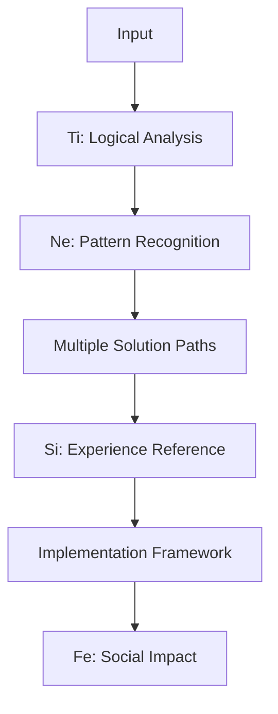
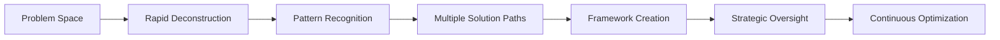
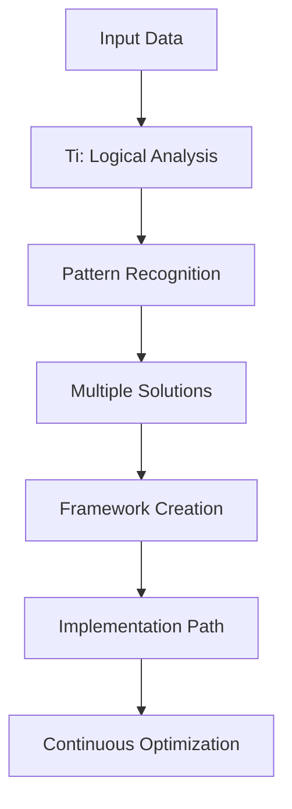
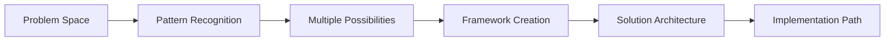

# 👋 Hi, I'm Daniel

### Systems Architect & Strategic Problem Solver (Ti-Ne-Si-Fe)

My greatest strength lies in rapidly understanding complex systems and envisioning comprehensive solutions, including detailed implementation paths. I excel at parallel processing and strategic thinking, while partnering effectively with those who drive methodical execution.

## 📚 Table of Contents
- [Cognitive Profile](#-cognitive-profile)
- [Core Characteristics](#-core-characteristics)
- [Professional Dynamics](#-professional-dynamics)
- [Team Collaboration](#-team-collaboration)
- [Technical Expertise](#-technical-expertise)
- [Contact & Connect](#-contact--connect)

## 🧠 Cognitive Profile

Click to expand detailed cognitive architecture

### Primary Cognitive Functions
- **Ti (Introverted Thinking)** - Primary processor & logical framework
- **Ne (Extraverted Intuition)** - Pattern recognition & possibility generation
- **Si (Introverted Sensing)** - Detail cataloging & experience reference
- **Fe (Extraverted Feeling)** - Social awareness & group dynamics

### Processing Architecture

### Operational Characteristics
- Operates like a high-powered processor optimized for parallel processing
- Excels at rapid system comprehension and solution architecture
- Naturally generates multiple solution paths simultaneously
- Transforms abstract possibilities into concrete action plans

## 💫 Core Characteristics

Click to expand natural strengths and preferences

### Natural Strengths
- Complex problem-solving
- Pattern recognition
- Innovative thinking
- Systems architecture
- Strategic planning
- Theoretical exploration

### Processing Style
- Highly analytical and objective
- Values precision and accuracy
- Naturally curious and exploratory
- Independent thinker
- Systems-oriented
- Adaptable and quick to grasp new concepts

### Communication Approach
- Precise and logical
- Prefers direct information exchange
- Values intellectual discourse
- Focuses on concepts and possibilities
- Appreciates theoretical discussions

## 🏢 Professional Dynamics

Click to expand workplace preferences and contributions

### Ideal Work Environments
- Research & Development
- Systems Architecture
- Software Engineering
- Scientific Research
- Strategy Consulting
- Technology Innovation
- Academic/Theoretical Positions
- Quantum Computing Design
- Artificial Intelligence Research
- Complex Systems Modeling

### Value Creation Style
• I excel at identifying hidden patterns and connections within complex systems, often seeing relationships that others miss
• I thrive when architecting comprehensive solutions that others can then methodically execute
• I bring unique value through my ability to generate multiple innovative solutions by approaching problems from unconventional angles
• I consistently contribute by challenging existing assumptions and introducing new perspectives that expand the solution space
• I naturally strengthen team problem-solving capabilities by introducing rigorous analytical approaches and logical frameworks

### Management Preferences
• I thrive in environments that recognize the value of comprehensive solution architecture and strategic problem decomposition
• I perform best when able to maintain high-level strategic oversight while partnering with those who drive specific implementation components
• I need the freedom to continue exploring optimization opportunities while implementation is underway
• I appreciate teams that understand the power of combining visionary thinking with methodical execution
• I function optimally when able to architect solutions that others can then own and drive to completion

### Growth Environment
- Intellectual challenges
- Innovation opportunities
- Strategic problem-solving
- Theoretical exploration
- Complex system design
- Continuous learning

## 🤝 Team Collaboration

Click to expand team dynamics and partnerships

### Collaborative Strengths
• I excel at breaking down complex problems into clear, actionable components that others can effectively own and implement
• I bring unique value through my ability to translate abstract possibilities into concrete, practical action plans
• I thrive when architecting comprehensive solutions that others can then methodically execute
• I consistently strengthen team effectiveness by creating clear frameworks that enable focused implementation
• I naturally enhance project success by maintaining strategic oversight while enabling others to drive specific components

### Partnership Preferences
• I partner effectively with teammates who enjoy taking well-defined components of a larger solution and driving them methodically to completion
• I create the most value when working with colleagues who appreciate receiving clear, detailed solution frameworks and can own the focused execution of specific elements
• I thrive in partnerships where others find satisfaction in maintaining steady progress on established paths, allowing me to continue exploring optimization opportunities
• I work best with team members who derive energy from consistent, focused execution, complementing my strength in strategic problem decomposition
• I value collaborators who excel at maintaining momentum on defined paths while I ensure our approach remains strategically sound and adaptable

### Team Contribution
- Strategic vision development
- Complex problem decomposition
- Innovation catalyst
- Systems thinking
- Theoretical framework creation
- Pattern recognition

## 🎯 Project Approach

Click to expand my working style and methodology

### Solution Architecture Process
• I excel at rapidly deconstructing complex challenges into their core components while maintaining a holistic view
• I naturally map multiple solution paths simultaneously, understanding their trade-offs and implications
• I create comprehensive frameworks that others can effectively implement and execute
• I maintain strategic oversight while enabling tactical execution by others
• I continuously identify optimization opportunities without disrupting established execution paths

### Cognitive Processing Style

### Value Optimization
- Strategic problem decomposition
- Comprehensive solution architecture
- Innovation through pattern recognition
- Theoretical framework development
- Systems-level optimization
- Continuous improvement identification

### Implementation Partnership
• I thrive when partnering with those who enjoy methodical execution of well-defined components
• I create clear, detailed solution frameworks that enable others to drive implementation
• I maintain strategic oversight while empowering others to own specific execution paths
• I ensure tactical actions align with broader strategic objectives
• I identify optimization opportunities without disrupting established momentum

## 🌟 Growth & Development

Click to expand learning style and development preferences

### Learning Preferences
- Deep theoretical understanding
- Systems-level comprehension
- Pattern-based learning
- Conceptual exploration
- Independent study
- Complex problem solving

### Growth Areas
- Emotional intelligence development
- Implementation follow-through
- Social connection building
- Practical execution
- Time management
- Deadline adherence

### Development Style
• I thrive in environments that encourage theoretical exploration and innovation
• I learn best through comprehensive understanding of underlying systems
• I prefer self-directed learning with access to deep resources
• I value intellectual challenge and complex problem-solving opportunities
• I grow through exposure to new concepts and theoretical frameworks

## 💻 Technical Expertise

Click to expand technical skills and tools

### Languages and Frameworks

### Tools and Technologies

### GitHub Statistics

## 📫 Contact & Connect

Click to expand contact information

### Direct Contact
- 📧 Email: daniel.bodnar@gmail.com
- 💼 LinkedIn: [danielbodnar](https://linkedin.com/in/danielbodnar)
- 🐦 Twitter: [@danielbodnar](https://twitter.com/danielbodnar)

### Coding Platforms

*"The best way to predict the future is to invent it." - Alan Kay*

---

  

  

---

*"The important thing is not to stop questioning. Curiosity has its own reason for existence." - Albert Einstein*

## 🔄 Decision Making Process

Click to expand decision-making approach and methodology

### Analytical Framework

### Processing Characteristics
• I naturally break down complex decisions into their constituent components
• I generate multiple solution paths simultaneously while evaluating trade-offs
• I create comprehensive frameworks that account for various scenarios
• I maintain flexibility while establishing clear logical structures
• I continuously identify optimization opportunities throughout the process

### Decision Criteria
- Logical consistency
- System-level impact
- Innovation potential
- Implementation feasibility
- Strategic alignment
- Long-term optimization

### Optimization Focus
• I excel at identifying hidden patterns and relationships within complex systems
• I naturally generate multiple innovative approaches to challenges
• I create clear frameworks that enable effective execution
• I maintain strategic oversight while enabling tactical implementation
• I ensure continuous improvement without disrupting momentum

## 💡 Innovation Style

Click to expand innovation approach and creative process

### Creative Process

### Innovation Characteristics
• I thrive on exploring theoretical possibilities and connecting disparate concepts
• I naturally identify patterns and relationships others might miss
• I generate multiple innovative solutions simultaneously
• I create comprehensive frameworks for implementation
• I maintain strategic oversight while enabling execution

### Value Creation
- Complex problem solving
- Pattern recognition
- Systems thinking
- Theoretical exploration
- Framework development
- Strategic innovation

### Implementation Approach
• I excel at translating abstract concepts into concrete frameworks
• I create clear implementation paths while maintaining flexibility
• I ensure strategic alignment throughout execution
• I identify optimization opportunities continuously
• I enable others to drive tactical execution effectively

---

<h3>🌐 Connect with me across the web</h3>

---

💡 Profile powered by Ti-Ne-Si-Fe cognitive architecture

